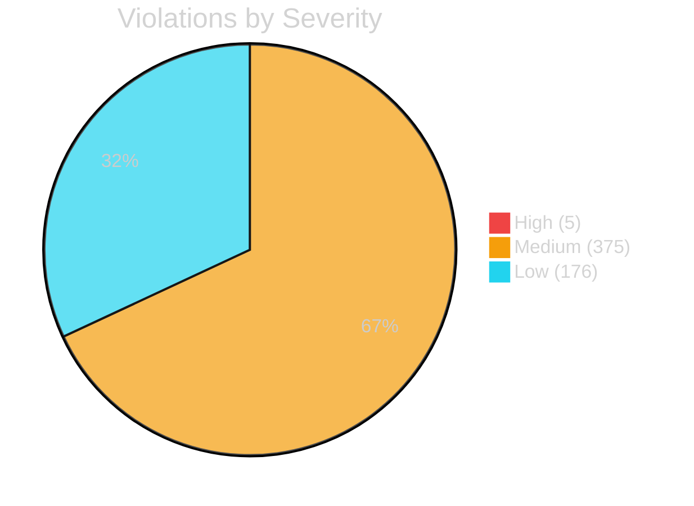

<div align="center">

# 🛡️ CodeGuard

**Python Code Quality & Security Analysis Tool**  
*12 checks · 9 output formats · 0.58s analysis · 20+ contributors*

[](LICENSE)
[](https://python.org)
[](https://github.com/mohameden19961/codeguard/actions)
[](https://mohameden19961.github.io/codeguard/)
[](https://github.com/mohameden19961/codeguard/releases)
[](https://github.com/mohameden19961/codeguard/stargazers)

---

```text
$ codeguard analyze src/
[21:10:52] [INFO] Running 12 checks on 279 files
[21:10:52] [INFO] Analysis complete: 556 violations in 279 files (0.58s)
```

</div>

---

## 🔮 Overview

**CodeGuard** is a comprehensive Python static analysis tool with **12 built-in checks** covering complexity, security, style, performance, documentation, naming, imports, duplication, typing, SSH config audit, and SSH key audit. It produces rich reports in **9 output formats** and integrates seamlessly with your CI/CD pipeline.

```bash
pip install -e .
codeguard analyze src/
```

---

## 📊 Project Metrics

<div align="center">

| Metric | Value |
|--------|-------|
| Files analyzed | 279 |
| Analysis time | 0.58s |
| Check categories | 12 |
| Output formats | 9 |
| Total commits | 4,147 |
| Contributors | 20+ |
| License | MIT |

</div>

---

## ✨ Feature Matrix

| Category | Detection Capabilities | Output |
|----------|----------------------|--------|
| 🔍 **Complexity** | Cyclomatic, nesting, function length, params | Terminal, JSON, HTML |
| 🛡️ **Security** | SQLi, command injection, path traversal | SARIF, HTML, JSON |
| 🎨 **Style** | Line length, whitespace, naming, imports | Terminal, HTML, Markdown |
| ⚡ **Performance** | Nested loops, memory, slow imports | JSON, CSV |
| 📚 **Documentation** | Module/function/class docstrings | HTML, Markdown |
| 🔐 **SSH Security** | Config audit, weak keys, port scanning | Terminal, JSON |
| 🔄 **Duplication** | Code clone detection, similarity | CSV, HTML |
| 🏷️ **Typing** | Type annotation coverage, return types | JUnit, XML |

---

## 🚀 Quick Start

```bash
# Analyze your code
codeguard analyze src/

# CI mode — fails on high+ violations
codeguard check src/ --severity high

# Generate HTML report
codeguard analyze src/ --format html --output report.html

# SARIF for GitHub Code Scanning
codeguard analyze src/ --format sarif --output results.sarif

# Auto-fix common issues
codeguard fix src/ --fixers trailing_whitespace,line_endings

# Create default config
codeguard init
```

---

## 📈 Severity Distribution



---

## 🔧 Configuration

```yaml
# .codeguard.yml
verbose: false
severity_threshold: medium
max_workers: 4
checks_enabled: [complexity, style, security, performance, documentation, naming, imports, duplication, typing, ssh_config, ssh_keys, ssh_port]
complexity:
  max_cyclomatic: 10
  max_nesting: 4
  max_lines_per_function: 50
  max_parameters: 6
style:
  max_line_length: 100
security:
  level: high
  check_sql_injection: true
  check_path_traversal: true
  check_command_injection: true
```

---

## 🧩 Plugin System

```python
# ~/.codeguard/plugins/my_check.py
from codeguard.checks.base import BaseCheck
from codeguard.core.types import Violation

class MyCheck(BaseCheck):
    name = "my_check"
    description = "My custom check"

    def check(self, file_path, content, lines):
        violations = []
        # Your custom logic here
        return violations
```

---

## 🔄 CI/CD Integration

### GitHub Actions

```yaml
steps:
  - uses: actions/checkout@v4
  - uses: actions/setup-python@v5
    with: {python-version: "3.11"}
  - uses: ./.github/actions/codeguard
    with:
      path: src/
      severity: medium
      format: sarif
```

### Pre-commit Hook

```yaml
repos:
  - repo: https://github.com/mohameden19961/codeguard
    rev: v0.2.0
    hooks:
      - id: codeguard
```

---

## 🧪 Testing

```bash
pip install -e ".[dev]"
pytest tests/ -v --cov=src/codeguard
```

---

## 📁 Project Structure

```
src/codeguard/
├── cli.py                    # CLI entry point
├── config.py                 # YAML configuration
├── core/
│   ├── engine.py             # Analysis engine
│   ├── collector.py          # File discovery
│   ├── types.py              # Data models
│   ├── reporter.py           # Report generation
│   └── formatter.py          # Results formatting
├── checks/
│   ├── base.py               # BaseCheck + CheckRegistry
│   ├── complexity.py         # Cyclomatic complexity
│   ├── style.py              # PEP 8 style
│   ├── security.py           # Vulnerability scanning
│   ├── ssh.py                # SSH config/key audit
│   └── ...                   # 10+ check modules
├── output/                   # 9 output format writers
├── fixers/                   # Auto-fix modules
├── utils/                    # Cache, parallel, logging
└── plugins/                  # Plugin system
```

---

## 🤝 Contributing

See [CONTRIBUTING.md](CONTRIBUTING.md) • [CODE_OF_CONDUCT.md](CODE_OF_CONDUCT.md) • [SECURITY.md](SECURITY.md)

## 📜 Changelog

See [CHANGELOG.md](CHANGELOG.md)

## 📄 License

**MIT** — see [LICENSE](LICENSE)

---

<div align="center">

**Built with ❤️ in Python** • 4,147 commits • 20+ contributors • [GitHub](https://github.com/mohameden19961/codeguard)

[](https://github.com/mohameden19961/codeguard/stargazers)
[](https://github.com/mohameden19961/codeguard/forks)

</div>
