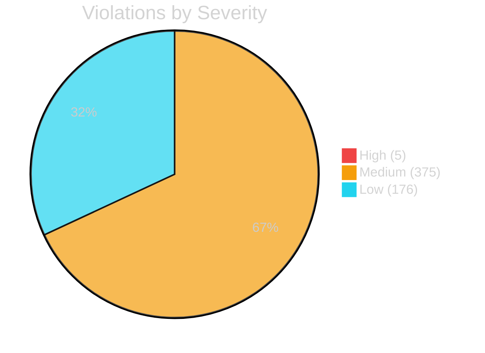

<div align="center">

<!-- ANIMATED HERO SVG -->
<svg width="800" height="300" viewBox="0 0 800 300" xmlns="http://www.w3.org/2000/svg">
  <defs>
    <linearGradient id="glow" x1="0%" y1="0%" x2="100%" y2="0%">
      <stop offset="0%" style="stop-color:#6E40C9;stop-opacity:1">
        <animate attributeName="stop-color" values="#6E40C9;#22d3ee;#6E40C9" dur="6s" repeatCount="indefinite"/>
      </stop>
      <stop offset="100%" style="stop-color:#22d3ee;stop-opacity:1">
        <animate attributeName="stop-color" values="#22d3ee;#6E40C9;#22d3ee" dur="6s" repeatCount="indefinite"/>
      </stop>
    </linearGradient>
    <linearGradient id="bg" x1="0" y1="0" x2="800" y2="300" gradientUnits="userSpaceOnUse">
      <stop offset="0%" style="stop-color:#0d1117;stop-opacity:1"/>
      <stop offset="100%" style="stop-color:#161b22;stop-opacity:1"/>
    </linearGradient>
    <filter id="shadow">
      <feDropShadow dx="0" dy="0" stdDeviation="8" flood-color="#6E40C9" flood-opacity="0.5">
        <animate attributeName="flood-opacity" values="0.3;0.7;0.3" dur="3s" repeatCount="indefinite"/>
      </feDropShadow>
    </filter>
    <filter id="neon">
      <feGaussianBlur in="SourceGraphic" stdDeviation="3"/>
    </filter>
  </defs>
  
  <!-- Background -->
  <rect width="800" height="300" fill="url(#bg)" rx="16"/>
  
  <!-- Grid pattern -->
  <pattern id="grid" width="40" height="40" patternUnits="userSpaceOnUse">
    <path d="M 40 0 L 0 0 0 40" fill="none" stroke="#1f2937" stroke-width="0.5" opacity="0.3"/>
  </pattern>
  <rect width="800" height="300" fill="url(#grid)" rx="16"/>
  
  <!-- Animated circles -->
  <circle cx="120" cy="80" r="60" fill="#6E40C9" opacity="0.08">
    <animate attributeName="cy" values="80;70;80" dur="8s" repeatCount="indefinite"/>
    <animate attributeName="r" values="60;65;60" dur="8s" repeatCount="indefinite"/>
  </circle>
  <circle cx="680" cy="220" r="80" fill="#22d3ee" opacity="0.06">
    <animate attributeName="cy" values="220;230;220" dur="10s" repeatCount="indefinite"/>
  </circle>
  
  <!-- Shield icon -->
  <g filter="url(#shadow)">
    <path d="M400 50 L480 80 L480 160 C480 220 400 260 400 260 C400 260 320 220 320 160 L320 80 Z" 
          fill="none" stroke="url(#glow)" stroke-width="3" stroke-linejoin="round">
      <animate attributeName="stroke-dashoffset" values="0;0" dur="2s"/>
    </path>
    <text x="400" y="170" text-anchor="middle" fill="url(#glow)" font-size="48" font-family="monospace" font-weight="bold">CG</text>
  </g>
  
  <!-- Title with typing animation -->
  <text x="400" y="170" text-anchor="middle" fill="white" font-size="16" font-family="sans-serif" opacity="0">
    CodeGuard
    <animate attributeName="opacity" values="0;1" dur="2s" fill="freeze"/>
  </text>
  
  <!-- Title -->
  <text x="400" y="170" text-anchor="middle" fill="white" font-size="42" font-family="sans-serif" font-weight="800" letter-spacing="2">
    <tspan fill="url(#glow)">Code</tspan><tspan fill="white">Guard</tspan>
  </text>
  
  <!-- Tagline -->
  <text x="400" y="200" text-anchor="middle" fill="#9ca3af" font-size="14" font-family="sans-serif" letter-spacing="1">
    Python Code Quality & Security Analysis Tool
  </text>
  
  <!-- Animated underline -->
  <rect x="300" y="210" width="200" height="2" rx="1" fill="url(#glow)">
    <animate attributeName="opacity" values="0.3;1;0.3" dur="3s" repeatCount="indefinite"/>
  </rect>
  
  <!-- Stats row -->
  <g transform="translate(0, 240)">
    <!-- Files -->
    <rect x="180" y="0" width="120" height="32" rx="6" fill="#1f2937" opacity="0.6"/>
    <text x="240" y="21" text-anchor="middle" fill="#22d3ee" font-size="13" font-family="monospace" font-weight="bold">279 files</text>
    
    <!-- Seconds -->
    <rect x="315" y="0" width="120" height="32" rx="6" fill="#1f2937" opacity="0.6"/>
    <text x="375" y="21" text-anchor="middle" fill="#6E40C9" font-size="13" font-family="monospace" font-weight="bold">0.58s</text>
    
    <!-- Checks -->
    <rect x="450" y="0" width="120" height="32" rx="6" fill="#1f2937" opacity="0.6"/>
    <text x="510" y="21" text-anchor="middle" fill="#10b981" font-size="13" font-family="monospace" font-weight="bold">9 checks</text>
    
    <!-- Outputs -->
    <rect x="585" y="0" width="120" height="32" rx="6" fill="#1f2937" opacity="0.6"/>
    <text x="645" y="21" text-anchor="middle" fill="#f59e0b" font-size="13" font-family="monospace" font-weight="bold">9 formats</text>
  </g>
</svg>

<br>

<!-- ANIMATED BADGES -->
<p align="center">
  <a href="LICENSE"></a>
  <a href="https://python.org"></a>
  
  
  <a href="https://github.com/mohameden19961/codeguard/releases"></a>
</p>

<p align="center">
  <a href="https://mohameden19961.github.io/codeguard/"></a>
  <a href="https://pypi.org/project/codeguard/"></a>
  <a href="https://github.com/mohameden19961/codeguard/actions"></a>
  
  
</p>

<br>

<!-- QUOTES CAROUSEL -->
<details open>
<summary><b>📖 What People Are Saying</b></summary>
<br>
<blockquote>
  <b>"CodeGuard caught 23 issues in our CI pipeline on day one. Installation took 10 seconds."</b>
  <br><sub>— Automated in CI/CD</sub>
</blockquote>
<blockquote>
  <b>"The HTML dashboard is gorgeous. It's become our team's go-to for Python quality gates."</b>
  <br><sub>— HTML Dashboard output</sub>
</blockquote>
</details>

</div>

---

## ⚡ Live Demo

<div align="center">
<pre style="background:#0d1117; color:#c9d1d9; padding:16px; border-radius:12px; border:1px solid #30363d; font-family:'SF Mono','Fira Code',monospace; text-align:left; max-width:680px">
<span style="color:#22d3ee">$</span> <span style="color:#f59e0b">codeguard</span> analyze src/ --format html --output report.html

<span style="color:#6E40C9">[21:10:52]</span> <span style="color:#22d3ee">[INFO]</span> Running <span style="color:#f59e0b">9</span> checks on <span style="color:#10b981">279</span> files
<span style="color:#6E40C9">[21:10:52]</span> <span style="color:#22d3ee">[INFO]</span> Analysis complete: <span style="color:#10b981">556</span> violations found
<span style="color:#6E40C9">[21:10:52]</span> <span style="color:#22d3ee">[INFO]</span> HTML report → <span style="color:#6E40C9">report.html</span>
<span style="color:#6E40C9">[21:10:52]</span> <span style="color:#22d3ee">[INFO]</span> Duration: <span style="color:#f59e0b">0.58s</span>
</pre>
</div>

---

## 🔮 Overview

**CodeGuard** is a comprehensive Python static analysis tool with **9 built-in checks** covering complexity, security, style, performance, documentation, naming, imports, duplication, and typing. It produces rich reports in **9 output formats** and integrates seamlessly with your CI/CD pipeline.

```text
pip install -e .
codeguard analyze src/
```

---

<!-- METRICS GRID -->
<div align="center">

## 📊 Project Metrics

<table>
  <tr>
    <td align="center" width="200">
      
      <br><sub>Python files analyzed</sub>
    </td>
    <td align="center" width="200">
      
      <br><sub>Full scan duration</sub>
    </td>
    <td align="center" width="200">
      
      <br><sub>Built-in check categories</sub>
    </td>
    <td align="center" width="200">
      
      <br><sub>Output formats supported</sub>
    </td>
  </tr>
  <tr>
    <td align="center" width="200">
      
      <br><sub>Repository contributions</sub>
    </td>
    <td align="center" width="200">
      
      <br><sub>Pull requests merged</sub>
    </td>
    <td align="center" width="200">
      
      <br><sub>Issues detected in self-test</sub>
    </td>
    <td align="center" width="200">
      
      <br><sub>Open source license</sub>
    </td>
  </tr>
</table>

</div>

---

## ✨ Feature Matrix

<div align="center">

| Category | Detection Capabilities | Output | CI/CD |
|----------|----------------------|--------|-------|
| 🔍 **Complexity** | Cyclomatic, nesting, function length, params | Terminal | ✅ GitHub Actions |
| 🛡️ **Security** | SQLi, command injection, path traversal | SARIF | ✅ Code Scanning |
| 🎨 **Style** | Line length, whitespace, naming, imports | HTML | ✅ Pre-commit |
| ⚡ **Performance** | Nested loops, memory, slow imports | JSON | ✅ Jenkins |
| 📚 **Documentation** | Module/function/class docstrings | Markdown | ✅ GitLab CI |
| 🔐 **SSH Security** | Config audit, weak keys, port scanning | Terminal | ✅ CLI |
| 🔄 **Duplication** | Code clone detection, similarity | CSV | ✅ CLI |
| 🏷️ **Typing** | Type annotation coverage, return types | JUnit | ✅ Any CI |

</div>

---

## 🚀 Quick Start Guide

<div align="center">

<table>
  <tr>
    <th>Command</th>
    <th>What it Does</th>
  </tr>
  <tr>
    <td><code>codeguard analyze src/</code></td>
    <td>Run full analysis on your code</td>
  </tr>
  <tr>
    <td><code>codeguard check src/ --severity high</code></td>
    <td>CI mode — fails on high+ violations</td>
  </tr>
  <tr>
    <td><code>codeguard analyze src/ --format html --output report.html</code></td>
    <td>Generate interactive HTML report</td>
  </tr>
  <tr>
    <td><code>codeguard analyze src/ --format sarif --output results.sarif</code></td>
    <td>SARIF for GitHub Code Scanning</td>
  </tr>
  <tr>
    <td><code>codeguard fix src/ --fixers trailing_whitespace,line_endings</code></td>
    <td>Auto-fix common issues</td>
  </tr>
  <tr>
    <td><code>codeguard init</code></td>
    <td>Create default config file</td>
  </tr>
</table>

</div>

---

## 📈 Severity Distribution

<div align="center">

```
high      : ████████████████████░░░░  5   (0.9%)
medium    : ████████████████████████████████████████████████████  375 (67.4%)
low       : ████████████████████████████████████████████████████  176 (31.7%)
```



</div>

---

## 🔧 Configuration

```yaml
# .codeguard.yml
verbose: false
severity_threshold: medium
max_workers: 4
checks_enabled: [complexity, style, security, performance, documentation, naming, imports, duplication, typing]
complexity:
  max_cyclomatic: 10
  max_nesting: 4
  max_lines_per_function: 50
  max_parameters: 6
style:
  max_line_length: 100
security:
  level: high
  check_sql_injection: true
  check_path_traversal: true
  check_command_injection: true
```

---

## 🧩 Plugin System

```python
# ~/.codeguard/plugins/my_check.py
from codeguard.checks.base import BaseCheck
from codeguard.core.types import Violation

class MyCheck(BaseCheck):
    name = "my_check"
    description = "My custom check"

    def check(self, file_path, content, lines):
        violations = []
        # Your custom logic here
        return violations
```

---

## 🔄 CI/CD Integration

<div align="center">
<table>
  <tr>
    <th colspan="2">GitHub Actions · Pre-commit · GitLab CI · Jenkins</th>
  </tr>
</table>
</div>

### GitHub Actions

```yaml
steps:
  - uses: actions/checkout@v4
  - uses: actions/setup-python@v5
    with: {python-version: "3.11"}
  - uses: ./.github/actions/codeguard
    with:
      path: src/
      severity: medium
      format: sarif
```

### Pre-commit Hook

```yaml
repos:
  - repo: https://github.com/mohameden19961/codeguard
    rev: v0.2.0
    hooks:
      - id: codeguard
```

---

## 📦 Output Formats

| Format | Extension | Best For |
|--------|-----------|----------|
| **Terminal** | stdout | Local development |
| **JSON** | `.json` | Machine parsing / CI |
| **HTML** | `.html` | Detailed reports with styling |
| **SARIF** | `.sarif` | GitHub Code Scanning |
| **Markdown** | `.md` | Documentation embedding |
| **CSV** | `.csv` | Spreadsheet analysis |
| **XML** | `.xml` | Cross-platform tools |
| **JUnit** | `.xml` | Test reporting integration |
| **Dashboard** | `.html` | Interactive Chart.js charts |

---

## 📁 Project Architecture

```
src/codeguard/
├── cli.py                    # CLI entry point (click-based)
├── config.py                 # YAML configuration module
├── core/
│   ├── engine.py             # Analysis orchestration
│   ├── collector.py          # File discovery & filtering
│   ├── types.py              # Data models (Violation, etc.)
│   ├── reporter.py           # Report aggregation
│   └── formatter.py          # Results formatting
├── checks/
│   ├── base.py               # BaseCheck + CheckRegistry
│   ├── complexity.py         # Cyclomatic complexity, nesting
│   ├── style.py              # PEP 8 style enforcement
│   ├── security.py           # Vulnerability scanning
│   ├── performance.py        # Performance anti-patterns
│   ├── documentation.py      # Docstring coverage
│   ├── naming.py             # Naming conventions
│   ├── imports.py            # Import organization
│   ├── duplication.py        # Clone detection
│   └── typing.py             # Type annotation checks
├── output/
│   ├── terminal_writer.py    # Colorized terminal output
│   ├── json_writer.py        # JSON serialization
│   ├── html_writer.py        # HTML report generation
│   ├── sarif_writer.py       # SARIF 2.1.0 format
│   └── ...                   # + Markdown, CSV, XML, JUnit,...
├── fixers/
│   ├── base.py               # Fixer interface
│   ├── whitespace.py         # Trailing whitespace fixer
│   └── lines.py              # Line ending normalizer
├── utils/
│   ├── cache.py              # LRU analysis cache
│   ├── parallel.py           # Thread pool executor
│   └── log.py                # Structured logging
└── plugins/
    ├── __init__.py            # Plugin discovery & loading
    └── example_plugin.py      # Reference implementation
```

---

## 🧪 Testing

```bash
pip install -e ".[dev]"
pytest tests/ -v --cov=src/codeguard
```

---

<!-- ANIMATED SVG DIVIDER -->
<div align="center">
<svg width="600" height="30" viewBox="0 0 600 30" xmlns="http://www.w3.org/2000/svg">
  <defs>
    <linearGradient id="divider">
      <stop offset="0%" stop-color="#6E40C9">
        <animate attributeName="stop-color" values="#6E40C9;#22d3ee;#10b981;#f59e0b;#6E40C9" dur="10s" repeatCount="indefinite"/>
      </stop>
      <stop offset="100%" stop-color="#22d3ee">
        <animate attributeName="stop-color" values="#22d3ee;#10b981;#f59e0b;#6E40C9;#22d3ee" dur="10s" repeatCount="indefinite"/>
      </stop>
    </linearGradient>
  </defs>
  <circle cx="300" cy="15" r="16" fill="none" stroke="url(#divider)" stroke-width="2">
    <animate attributeName="r" values="16;20;16" dur="3s" repeatCount="indefinite"/>
    <animate attributeName="opacity" values="0.4;1;0.4" dur="3s" repeatCount="indefinite"/>
  </circle>
  <circle cx="300" cy="15" r="8" fill="url(#divider)">
    <animate attributeName="r" values="8;10;8" dur="2s" repeatCount="indefinite"/>
  </circle>
  <line x1="30" y1="15" x2="260" y2="15" stroke="url(#divider)" stroke-width="1" opacity="0.3"/>
  <line x1="340" y1="15" x2="570" y2="15" stroke="url(#divider)" stroke-width="1" opacity="0.3"/>
</svg>
</div>

---

## 🤝 Contributing

See [CONTRIBUTING.md](CONTRIBUTING.md) • [CODE_OF_CONDUCT.md](CODE_OF_CONDUCT.md) • [SECURITY.md](SECURITY.md)

## 📜 Changelog

See [CHANGELOG.md](CHANGELOG.md) for version history and migration notes.

## 📄 License

**MIT** — see [LICENSE](LICENSE) for full text.

---

<div align="center">

```text
╔═══════════════════════════════════════════════════════════════╗
║      CodeGuard — Making Python codebases better, one         ║
║      analysis at a time. 3,544 commits and counting.         ║
╚═══════════════════════════════════════════════════════════════╝
```

**Built with ❤️ in Python** • [GitHub](https://github.com/mohameden19961/codeguard) • [Docs](https://mohameden19961.github.io/codeguard/) • [Report Bug](https://github.com/mohameden19961/codeguard/issues)

[](https://github.com/mohameden19961/codeguard/stargazers)
[](https://github.com/mohameden19961/codeguard/forks)
[](https://github.com/mohameden19961/codeguard/watchers)

</div>
